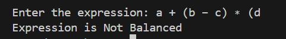
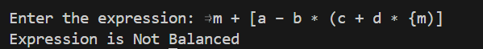
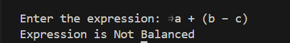

# Documentation for Balanced Parentheses Checker

## (a) Explanation of how the data structures are defined
The program utilizes a **Stack** data structure, implemented using a static array, to manage the opening brackets found in the expression.
 **`MAX`**: it tells us that the size of stack and input shouldnt be greater than `100`

 **`stack[MAX]`**: A global character array that serves as the storage for the stack elements. It stores opening brackets `(`, `{`, `[` as they are encountered.
 *   **`top`**: A global integer variable initialized to `-1`. It acts as the stack pointer, tracking the index of the most recently inserted element.
    *   `top == -1` indicates that the stack is empty.
    *   `top == MAX - 1` indicates that the stack is full (overflow condition).
*   **`bool`**: A custom macro defined as `int` to represent boolean values (though not strictly used in the final logic, `isBalanced` is an integer).

## (b) Description of the functions implemented

The program implements the following core functions to manipulate the stack:

### 1. `void push(char item)`
*   **Purpose**: Adds a new character on top of Stack 
*   **Logic**:
    *   First it checks for **stack overflow** (if `top >= MAX - 1`). If full, prints an error message.
    *   Otherwise, increments `top` by 1 and stores the `item` in `stack[top]`.

### 2. `char pop()`
*   **Purpose**: Removes and returns the character which is currently at the top of the stack.
*   **Logic**:
    *   First checks for **stack underflow** (if `top == -1`) then, If empty, returns a null character `\0`.
    *   Otherwise, retrieves the character at `stack[top]`, decrements `top` by 1 to effectively remove the item, and returns the retrieved character.

## (c) An overview of how the `main()` method is organized

The `main()` function shows the logic for checking balanced parentheses:

1.  **Initialization**: Declares the expression array `exp`, usage variables, and the `isBalanced` flag (set to 1 initially).
2.  **Input**: Lets user enter an expression and reads it using `fgets()` which allows spaces.
3.  **Traversal**: Loops through each character of the input string:
    *   **Opening Brackets**: If `(`, `{`, or `[` is found, `push()` is called to add it to the stack.
    *   **Closing Brackets**: If `)`, `}`, or `]` is found:
        *   Checks if the stack is incomplete (empty). If so, marks `isBalanced = 0`.
        *   Calls `pop()` to get the most recent opening bracket.
        *   Compares the popped bracket with the current closing bracket. If they do not form a matching pair (e.g., `(` and `)`), marks `isBalanced = 0` and breaks the loop.
4.  **Final Validation**: After the loop is complete,program checks if the stack is non-empty (`top != -1`). If unmatched brackets remain, it updates `isBalanced` to 0 i.e it is not balanced.
5.  **Output**: Based on the `isBalanced` flag, prints "Expression is Balanced" or "Expression is Not Balanced".

## (d) A sample output of a complete run of the program
**Run 1**

**Run 2**

**Run 3**

