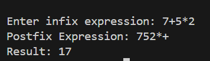

# Documentation for Balanced Parentheses Checker

## (a) Explanation of how the data structures are defined
The program uses two separate Stacks to handle the different data types involved in the process.

1.  **Operator Stack (Character Stack)**:
    *   `char stack[MAX]`: Used during the conversion phase to store operators (`+`, `-`, `*`, etc.) and parentheses.
    *   `int top`: Tracks the top element of the operator stack. Initialized to ` -1`.

2.  **Operand Stack (Integer Stack)**:
    *   `int intStack[MAX]`: Used during the evaluation phase to store intermediate calculation results (integers).
    *   `int intTop`: Tracks the top element of the integer stack. Initialized to `-1`.

## (b) Description of the functions implemented

The program implements the following core functions to manipulate the stack:

*   **`void push(char item)`**: Pushes a character operator onto the global `stack`and checks for overflow.
*   **`char pop()`**: Pops and returns the top character from the `stack`and returns `-1` if empty.
*   **`void pushInt(int item)`**: Pushes an integer value onto the global `intStack` used during the evaluation.
*   **`int popInt()`**: Pops and returns the top integer from the `intStack`.
*   **`int priority(char x)`**: Returns an integer representing the precedence of an operator. Higher numbers mean higher priority (e.g., `^` is 3, `*` is 2, `+` is 1).
*   **`int calc(int a, int b, char op)`**: Helper function that takes two operands and an operator char, performs the math, and returns the result.

## (c) An overview of how the `main()` method is organized

The `main` function is divided into two main parts:

1.  **Infix to Postfix Conversion**:
    *   It reads the infix string.
    *   Iterates through each character:
        *   If it's a number/alphanumeric, print it to the `postfix` string directly.
        *   If it's `(`, push to stack.
        *   If it's `)`, pop everything until `(` is found.
        *   If it's an operator, pop higher/equal priority operators from the stack to the `postfix` string, then push the new one.
    *   After the loop, empties any remaining operators in the stack.

2.  **Postfix Evaluation**:
    *   Iterates through the generated `postfix` string.
    *   If the char is a digit, it converts it to an int (by subtracting `'0'`) and pushes it to `intStack`.
    *   If it's an operator, it pops two numbers from `intStack`, calls `calc()` to solve them, and pushes the result back.
    *   Finally, prints the result remaining at the top of `intStack`.

## (d) A sample output of a complete run of the program
**POSTFIX OF EXPRESSION**

