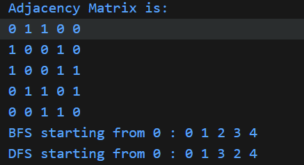

# Documentation for Adjacancy

## (a) Explanation of how the data structures are defined
The program uses global arrays and variables to represent the graph and facilitate traversals:
*   **`int graph[MAX][MAX]`**: A 2D array (adjacency matrix) used to store the graph connectivity. `graph[i][j] = 1` indicates an edge between vertex `i` and `j`, while `0` indicates no edge. `MAX` is defined as 10.
*   **`int seen[MAX]`**: An array to keep track of visited vertices during traversal. `seen[i] = 1` means vertex `i` has been visited.
*   **`int q[MAX]`**: An array used as a queue for BFS traversal.
*   **`int f`, `r`**: Integers representing the `front` and `rear` indices of the queue. They are initialized to `-1` to indicate an empty queue.
*   **`int totalV`**: Stores the total number of vertices in the graph.

## (b) Description of the functions implemented

The program implements the following functions:

**1. `void setupGraph(int v)`**
*   **Purpose:** Initializes the graph structure.
*   **Logic:** Sets `totalV` to the given number of vertices `v`. Initializes the `seen` array to `0` (unvisited) and the `graph` adjacency matrix to `0` (no edges).

**2. `void connect(int a, int b)`**
*   **Purpose:** Adds an undirected edge between two vertices.
*   **Logic:** Sets `graph[a][b] = 1` and `graph[b][a] = 1`, marking the connection in both directions.

**3. `void pushQ(int x)`**
*   **Purpose:** Enqueues an element `x` into the queue.
*   **Logic:** increments `r` and adds `x` to `q[r]`. Initializes `f` to 0 if the queue was empty. Checks for overflow (does nothing if full).

**4. `int popQ()`**
*   **Purpose:** Dequeues an element from the queue.
*   **Logic:** returns `q[f]` and increments `f`. Returns `-1` if the queue is empty or `f > r`.

**5. `int isQEmpty()`**
*   **Purpose:** Checks if the queue is empty.
*   **Logic:** Returns `1` (true) if `f == -1` or `f > r`, otherwise returns `0` (false).

**6. `void runBFS(int start)`**
*   **Purpose:** Performs Breadth-First Search traversal.
*   **Logic:** Resets the `seen` array and queue. Marks the `start` vertex as visited and enqueues it. Then loops while the queue is not empty: dequeues a vertex, prints it, and enqueues all its unvisited adjacent neighbors, marking them as visited.

**7. `void runDFS(int start)`**
*   **Purpose:** Performs Depth-First Search traversal (wrapper).
*   **Logic:** Resets the `seen` array to ensure a fresh traversal. Prints the start message and calls the recursive helper `dfsUtil(start)`.

**8. `void dfsUtil(int v)`**
*   **Purpose:** Recursive helper function for DFS.
*   **Logic:** Prints the current vertex `v` and marks it as visited. Then iterates through all vertices; if an adjacent vertex is unvisited, it recursively calls `dfsUtil` on that vertex.

## (c) An overview of how the `main()` method is organized

The `main()` function serves as the driver:
*   **Graph Setup:** Calls `setupGraph(5)` to initialize a graph with 5 vertices.
*   **Edge Creation:** Calls `connect` repeatedly to add edges (0-1, 0-2, 1-3, 2-3, 2-4, 3-4), building specific connectivity.
*   **Matrix Display:** Iterates through the `graph` array to print the adjacency matrix, showing the connections visually.
*   **BFS Execution:** Calls `runBFS(0)` to start a Breadth-First Search from vertex 0 and print the traversal order.
*   **DFS Execution:** Calls `runDFS(0)` to start a Depth-First Search from vertex 0 and print the traversal orde
## (d) A sample output of a complete run of the program
**Run**

